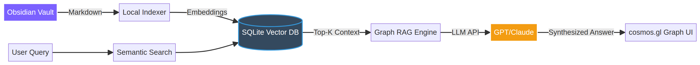

# Graph RAG for Obsidian

### GPU-accelerated knowledge graph visualization with Graph RAG

 

---

## 🚀 Overview

An interactive, GPU-accelerated knowledge graph visualization with **Graph RAG** (Retrieval-Augmented Generation) for Obsidian. Powered by `cosmos.gl`.

## 🧠 How Graph RAG Works

  

Graph RAG combines **vector similarity search** with **knowledge graph traversal** to provide richer, more contextual answers from your vault. Instead of just finding notes that are semantically similar to your question, it also explores the connections between those notes to synthesize comprehensive answers.

## ✨ Features

- **GPU Rendering**: Handles massive vaults smoothly via `cosmos.gl`
- **Local Indexing**: SQLite-backed vector embeddings
- **Contextual Chat**: Ask your vault questions and get cited, graph-aware answers
